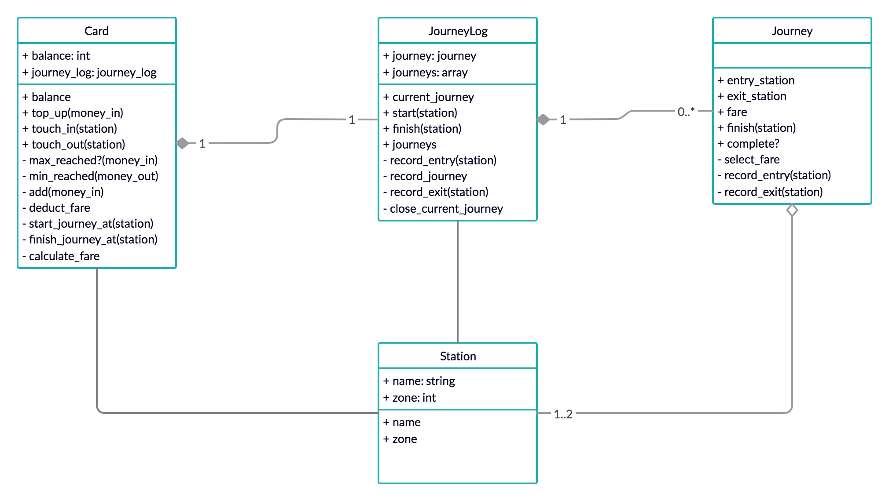

# Metro Card
Object based system to automatize the use of an electronic public transport card. The card can be used touch in, touch out or top up credit as different fares are charged depending on the journey.

## Table of Contents
* [Code Quality](#code-quality)
* [Technologies](#technologies)
* [Getting Started](#getting-started)
* [Testing](#testing)
* [Domain Model](#domain-model)
* [Principles and takeaways](#principles-and-takeaways)
* [Analysis](#analysis)
* [Author](#author)

## Code Quality
[](https://codeclimate.com/github/xelAhcratiPsavilO/metro_card/maintainability)

## Technologies
- Main technology
  - [Ruby](https://www.ruby-lang.org/en/) - High-level, general-purpose language utilized as main technology.
- Unit Test
  - [RSpec](https://rspec.info/) - Domain specific language utilized as testing tool.
- Feature Test
  - [IRB](https://en.wikipedia.org/wiki/Interactive_Ruby_Shell) - Interactive ruby shell utilized as a REPL.
- Documentation
  - [MD](https://www.markdownguide.org/) - Lightweight markup language utilized for documentation.

## Getting Started

Follow the instructions below to clone the repository and run it locally for testing and development demonstrations.

### Prerequisites
- Verify that a current version of Ruby is installed:
```bash
ruby -v
```

### Installing
- Clone the repository:
```bash
git clone git@github.com:xelAhcratiPsavilO/metro_card.git
```
- Launch irb, pry or other ruby REPL:
```bash
irb
```
### Running
- Load the Card class (similarly for any other class):
```bash
> require './lib/card'
=> true
```
- Create a new Card instance (similarly for any other class):
```bash
> card = Card.new
=> #<Card:0x00007f8aee176d50>
```

### Testing
- Launch RSpec to verify that all tests are passing:
```bash
rspec
```
- Expected output:
```bash
....
Finished in 0.11557 seconds (files took 0.57985 seconds to load)
33 examples, 0 failures
```

## Domain Model

High-level overview of the entities that make up this functional system.



Based on [client's requirements](USER_STORIES.md).

Objects-Messages [diagram](DIAGRAM.md).

## Principles and takeaways
Forwarding methods allows to encapsulate behavior in new objects maintaining code in line with the single responsibility principle. Dependency injection looses the coupling between objects, making the system more flexible, scalable and testable in isolated units. Abstraction and privatization of methods and properties allows to hide complexity creating simpler interfaces and reducing the impact of change.

## Analysis
It would have been interesting expanding on the existing functionality by creating different zones for the Station class. That expansion on the system would have made the deducted fare even more variable, as it currently depends on the completion of the journey in order to charge a penalty fare or a regular one. A scalable design and seamless integration allowed the extraction and encapsulation of responsibilities into several classes.

## Author

Alejandro Pitarch Olivas
